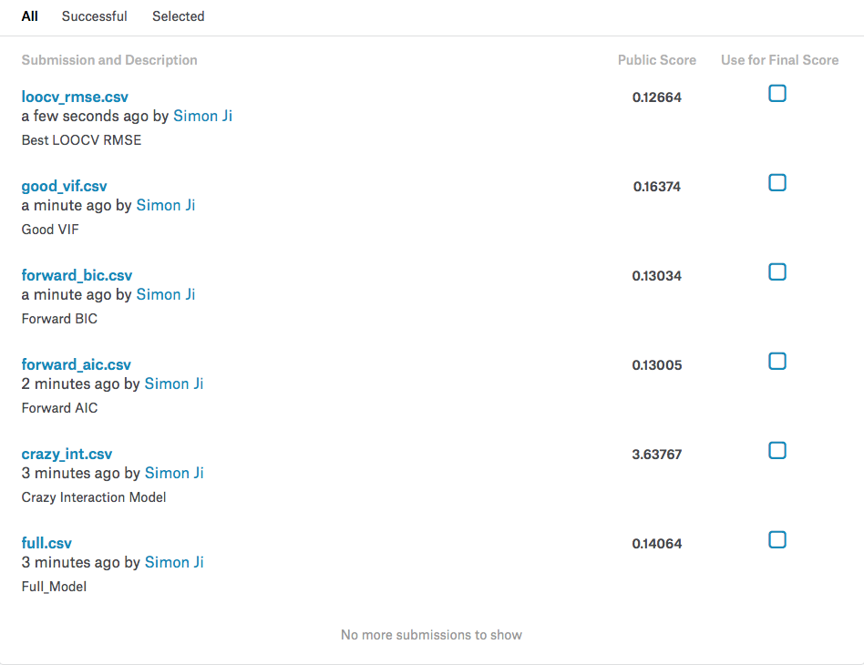

#Introduction
##Overview
In this project, we will build a linear model that can predict residential home prices in Ames, Iowa based on several explanatory variables.  This project is a practical example of using real world data that consists of a mix of different data types - nominal, ordinal, discrete, and continuous variables. 

We will incorporate the following topics covered in this course: 

- Variable manipulation
- Data analysis and interpretation
- Model building
- Model evaluation

##Description of Dataset

The data set describes the sale of individual residential property in Ames, Iowa from 2006 to 2010 and contains 2,919 observations.  There are 80 explanatory variables (23 nominal, 23 ordinal, 14 discrete, and 20 continuous) involved in assessing home values.

The 23 nominal variables identify various types of dwellings, materials, garages, and environmental conditions.

The 23 ordinal variables range from 2 to 28 representing Streets (gravel or paved) and Neighborhoods (areas within the Ames city limits).

The 14 discrete variables quantify the number of items for each house.  Items include the number of kitchens, bedrooms, bathrooms, garage spaces and their respective location if the house has more than one floor. 

The 20 continuous variables are related to area dimensions for each house.  Variables include total dwelling square footage, total lot size, living area, and room dimensions. 

Some important variables that may have strong correlation with sale price.

- `GrLivArea`: Above grade (ground) living area square feet.
- `Neighborhood`: Physical locations within Ames city limits.
- `MSZoning`: Identifies the general zoning classification of the sale.
- `LotArea`:  Lot size in square feet.
- `OverallQual`: Overall material and finish quality.
- `TotalBsmtSF`: Total square feet of basement area.
- `YearBuilt`: Original construction date.
- `BedroomAbvGr`: Bedrooms above grade (does NOT include basement bedrooms).
- `BsmtFullBath`:  Full bathrooms above grade.
- `GarageCars`: Size of garage in car capacity.

##Dataset Source

Inspired by [`Kaggle Competition`](https://www.kaggle.com/c/house-prices-advanced-regression-techniques), the data set is provided by Dean De Cock from Truman State University.  The raw data comes directly from the Iowa State Assessorʻs Office. The initial Excel file contained 113 variables describing 3,970 property sales that had occurred in Ames, Iowa between 2006 and 2010. 
The variables were a mix of nominal, ordinal, continuous, and discrete variables used in calculation of assessed values and included physical property measurements in addition to computation variables used in the city’s assessment process. Variables that required specific housing or assessing knowledge or previous calculations were removed from the final dataset.  

# Methods
## Check the Data{#check_the_data}
```{r, include=FALSE}
source("util.R")
```

We load the dataset and store it to variable `house_data`. `SalePrice` is the response variable and others are predictors. Let's do some quick check on the dataset.
```{r, include=FALSE}
library(readr)
house_data = read_csv("HousePrices/train_updated.csv")
head(house_data)
```

```{r, echo=FALSE, fig.height=8, fig.width=8}
par(mfrow=c(3,2))
plot(SalePrice ~ GrLivArea, data = house_data, pch  = 20, cex  = 2, col  = "dodgerblue", main = "SalePrice ~ GrLivArea")
hist(house_data$SalePrice, col = "dodgerblue",border = "darkorange", main = "Histogram of SalePrice", xlab = "SalePrice")
hist(house_data$GrLivArea, col = "dodgerblue",border = "darkorange", main = "Histogram of GrLivArea", xlab = "GrLivArea")
hist(house_data$LotArea, col = "dodgerblue",border = "darkorange", main = "Histogram of LotArea", xlab = "LotArea")
boxplot(SalePrice ~ OverallQual, data = house_data, pch = 20, cex = 2, col = "darkorange", border = "dodgerblue",  xlab   = "OverallQual", ylab   = "SalePrice", main   = "SalePrice ~ OverallQual")
boxplot(SalePrice ~ Neighborhood, data = house_data, pch = 20, cex = 2, col = "darkorange", border = "dodgerblue", xlab   = "Neighborhood", ylab   = "SalePrice", main   = "SalePrice ~ Neighborhood")
```

Note: boxplot is better than plot to illustrate relation between SalePrice and categorical predictor.

####Outliers
Plot:`SalePrice ~ GrLivArea` does show 4 obvious outliers records when GrLivArea is greater 4000 SF, The 2 located on the top-right still within the scope of linear relation. The other 2 located on bottom-right are a little special. By inspecting these records, we noticed that they are both `Partial` for `SaleCondition`. This probably explain part of the reason. Since we don't have strong evidence they are bad records, we will leave them in the dataset and hope categorical variable can fit them well.

## Data Preprocessing

In this section, we are going to do some clean-up and transformation to our dataset to help later model selection and evaluation.

####Change Predictor Name
R doesn't allow variable name start with a number. Although we could work around this problem. Dataset with bad name will cause some coding trouble later. Thus, we change some dataset column names to comply with R variable definition.
```{r}
replace_names = function(data, name_pairs) {
  new_names = colnames(data)
  for (i in 1:length(name_pairs)) {
    new_names[which(new_names ==  name_pairs[i])] = names(name_pairs[i])
  }
  new_names
}

BadNames =  c(FirstFlrSF = "1stFlrSF", SecondFlrSF = "2ndFlrSF", ThreeSsnPorch = "3SsnPorch")

colnames(house_data) = replace_names(house_data, BadNames)
```

We maintain all categorical predictor names in variable `CategoricalPredictors` and numerical predictor names in variable `NumericPredictors`.
```{r, include=FALSE}
CategoricalPredictors = c("MSSubClass", "MSZoning", "Street", "Alley", "LotShape",
            "LandContour", "Utilities", "LotConfig", "LandSlope", 
            "Neighborhood", "Condition1", "Condition2", "BldgType", 
            "HouseStyle", "OverallQual", "OverallCond", "RoofStyle", 
            "RoofMatl", "Exterior1st", "Exterior2nd", "MasVnrType",
            "ExterQual", "ExterCond", "Foundation", "BsmtQual", 
            "BsmtCond", "BsmtExposure", "BsmtFinType1", "BsmtFinType2", 
            "Heating", "HeatingQC", "CentralAir", "Electrical", 
            "KitchenQual", "Functional", "FireplaceQu", 
            "GarageType","GarageFinish", "GarageQual", "GarageCond", 
            "PavedDrive", "PoolQC", "Fence", "MiscFeature", 
            "SaleType", "SaleCondition", "MoSold")

NumericPredictors = colnames(house_data)[!colnames(house_data) %in% c(CategoricalPredictors, "Id")]
```

```{r}
(CategoricalPredictors)
(NumericPredictors)
```

####Missing Data

In this step, we will clear the dataset through these steps: 

- Remove predictor with too many NAs (> 20%). According to the data description, NA is not an invalid value for most categorical predictors, but too many NA is less informative and makes too much noises.
- Convert categorical predictor to factor and make NA an extra value.
- Replace numerical NA with mean. 

```{r}
RM_Names = c()                              #This variable stores predictor names to be removed
for(name in colnames(house_data)) {
  nas = is.na(house_data[[name]])
  
  if(sum(nas) / nrow(house_data) > 0.2) {
    print(paste("(", name, ") Removed"))
    RM_Names = c(RM_Names, name)
  } else {
    if(name %in% CategoricalPredictors) {   #Categorical predictor
      house_data[[name]] = factor(house_data[[name]], exclude = NULL)
    } else{
      if(sum(nas) > 0) {
        house_data[[name]][nas] = mean(house_data[[name]][!nas])
      }
    }
  }
}

#Remove dataset columns
house_data = house_data[, !colnames(house_data) %in% RM_Names]

#Remove these predictors from categorical predictor names
CategoricalPredictors = CategoricalPredictors[CategoricalPredictors %in% colnames(house_data)]
#Remove these predictors from numerical predictor names
NumericPredictors = NumericPredictors[NumericPredictors %in% colnames(house_data)]
```

####Normalize Data
Through plots in section [Check the Data](#check_the_data), we can see distribution of `SalePrice` is right skewed. The variance of `SalePrice ~ GrLivArea` linear relation is also not constant. Check the summary of these 2 variables.
```{r}
summary(house_data$SalePrice)
summary(house_data$GrLivArea)
```
The range of these 2 variables are relatively large. To extend this thinking, it is very likely some variables for space size (like: GrLivArea, LotArea) may have same characteristic. We can normalize and stablize the data to fit the linear model better.

As the rule, we find the numerical predictors that have large range ($\frac{max}{min} \geq 10$) and replace it with log value.

**Note**: It is not recommended to change dataset directly and better to use log form of formula when fitting a model. We do this to benefit our later analysis and model selection. Log transformation on dataset can also help to improve performance when dataset is large because you don't have to do such transformation for every to be evaluated models in lm().

```{r}
Log_Names = c()
for(name in NumericPredictors) {
  if(range(house_data[[name]])[1] > 0 && 
     range(house_data[[name]])[2] / range(house_data[[name]])[1] > 10) {
    Log_Names = c(Log_Names, name)
  }
}

#Show predictors need to be log transformed
(Log_Names)
```
```{r}
house_data = log_data(house_data, Log_Names)
```

We replot the dataset.

```{r, echo=FALSE, fig.height=8, fig.width=8}
par(mfrow=c(3,2))
plot(Log_SalePrice ~ Log_GrLivArea, data = house_data, pch  = 20, cex  = 2, col  = "dodgerblue", main = "log(SalePrice) ~ log(GrLivArea)")
hist(house_data$Log_SalePrice, col = "dodgerblue",border = "darkorange", main = "Histogram of log(SalePrice)", xlab = "log(SalePrice)")
hist(house_data$Log_GrLivArea, col = "dodgerblue",border = "darkorange", main = "Histogram of log(GrLivArea)", xlab = "log(GrLivArea)")
hist(house_data$Log_LotArea, col = "dodgerblue",border = "darkorange", main = "Histogram of log(LotArea)", xlab = "log(LotArea)")
boxplot(Log_SalePrice ~ OverallQual, data = house_data, pch = 20, cex = 2, col = "darkorange", border = "dodgerblue", xlab   = "OverallQual", ylab   = "log(SalePrice)", main   = "log(SalePrice) ~ OverallQual")
boxplot(Log_SalePrice ~ Neighborhood, data = house_data, pch = 20, cex = 2, col = "darkorange", border = "dodgerblue", xlab   = "Neighborhood", ylab   = "log(SalePrice)", main   = "log(SalePrice) ~ Neighborhood")
```

**Notice** except `Log_SalePrice ~ Neighborhood` doesn't have noticable change, other plots look much more normalized and linear.

####Combine Predictors
The original data use `FullBath` and `HalfBath` to describe bathroom information. `HalfBath` itself dosen't have strong relation with the price. Thus, we combine these two predictors to simplify the model and describe the SalePrice better.

```{r}
#Combine FullBath and HalfBath
house_data$Bath = house_data$FullBath + house_data$HalfBath * 0.5
house_data = subset(house_data, select = -c(Id, FullBath, HalfBath))
```

##Predictor Selection

In this section, we make selection on significant predictors and fine tune them to build models for prediction.

####Visualize Correlation
Let's first have some intuition on the correlation of the data.

$## Correlation pairs plot##$

```{r, echo=FALSE, fig.height=8, fig.width=8}
#We convert all factor variables to numeric in order to call cor()
num_house_data = house_data
for(name in colnames(num_house_data)){
  if(is.factor(num_house_data[[name]])) 
    num_house_data[[name]] = as.numeric(num_house_data[[name]])
}

# number of corr plots
house_cols = colnames(num_house_data)
x = (length(house_cols)-1)/10

for (i in 0:(x-1)){
  pairs(num_house_data[, c(house_cols[(10*i+1):(10*(i+1))], "Log_SalePrice")], col="dodgerblue")
}
```

$## Examine correlation between `Log_SalePrice` and numerical predictors ##$

```{r, echo=FALSE}
non_factors = c("Log_LotFrontage", "Log_LotArea", "YearBuilt", 
                "YearRemodAdd", "MasVnrArea", "BsmtFinSF1",
                "BsmtFinSF2", "BsmtUnfSF", "TotalBsmtSF", 
                "LowQualFinSF", "Log_FirstFlrSF",
                "Log_GrLivArea", "BsmtFullBath", "BsmtHalfBath",
                "BedroomAbvGr", "KitchenAbvGr", 
                "TotRmsAbvGrd", "Fireplaces", "GarageYrBlt",
                "GarageCars", "GarageArea", "WoodDeckSF", 
                "OpenPorchSF", "EnclosedPorch",  
                "ScreenPorch", "PoolArea", "MiscVal", "Log_SalePrice")

nf_data = data.frame(sapply(house_data[, non_factors], function(x) as.numeric(x)))
colnames(nf_data) = non_factors
nf_corr = cor(nf_data)
sort(nf_corr["Log_SalePrice",], decreasing=TRUE)
```

$## Histogram ##$

Histograms of the numerical predictors that are significant.

```{r, echo=FALSE, fig.height=8, fig.width=8}
top_corrs = sort(nf_corr["Log_SalePrice", ], decreasing=TRUE)[sort(nf_corr["Log_SalePrice", ], decreasing=TRUE) > 0]
top_corrs_name = names(top_corrs[2:length(top_corrs)])

par(mfrow=c(4,3))
for (name in top_corrs_name[1:12]){
  hist(nf_data[,name], breaks=20, xlab=name, main="hist ", col="dodgerblue")
}
```

$## Log_SalePrice vs Top Correlated Features ##$
```{r, echo=FALSE, fig.height=8, fig.width=8}
par(mfrow=c(3,3))
for (name in top_corrs_name[1:9]){
  plot(nf_data[,name], house_data$Log_SalePrice, xlab=name, ylab="SalePrice", col="blue")
  p_mod = lm(house_data$Log_SalePrice ~ nf_data[,name])
  abline(coef(p_mod)[1], coef(p_mod)[2], col="orange", lwd=2)
}

par(mfrow=c(3,3))
for (name in top_corrs_name[10:18]){
  plot(nf_data[,name], house_data$Log_SalePrice, xlab=name, ylab="SalePrice", col="blue")
  p_mod = lm(house_data$Log_SalePrice ~ nf_data[,name])
  abline(coef(p_mod)[1], coef(p_mod)[2], col="orange", lwd=2)
}
```

####Store Significant Predictors
After we have some basic understanding on our data correlation, we select the significant predictors that have high correlation with SalePrice and store these predictor names to `Start_Pre_Names`.

```{r, echo=FALSE}
all_cor = cor(num_house_data)
(sig_cor = sort(abs(all_cor["Log_SalePrice", abs(all_cor["Log_SalePrice",]) > 0.5]), decreasing = TRUE)[-1])

Start_Pre_Names = names(sig_cor)
```

####Start Model Building
We first build a model with predictors that has correlation values > 0.5.

```{r, warning=FALSE}
sig_model = lm(build_formula("Log_SalePrice", Start_Pre_Names), data = house_data)
summary(sig_model)$adj.r.squared
```
Looks this model has reasonable Adjusted $R^2$. 

####Solve Collinearity Problem
```{r, message=TRUE, warning=FALSE}
library(faraway)
sort(vif(sig_model)[vif(sig_model) > 5], decreasing = TRUE)
```
We see many predictors has high VIFs. High VIFs could introudce trouble to parameter inference and impact model's ability to predict. It also cause problem to analyze high leverage and calculate LOOCV RMSE because not able to solve $\left(X^\top X\right)^{-1}$.

We see `OverallQual` gives us the most trouble although VIF of `OverallQual2` is `r vif(sig_model)["OverallQual2"][[1]]`. Let's first try to remove this predictor and see what will happen.
```{r}
var_names = names(sig_cor)[names(sig_cor) != "OverallQual"]
no_overallqual_model = lm(build_formula("Log_SalePrice", var_names), 
                          data = house_data)
summary(no_overallqual_model)$adj.r.squared
```
Removing `OverallQual` causes Adjusted $R^2$ dropped `r summary(sig_model)$adj.r.squared - summary(no_overallqual_model)$adj.r.squared`. Intuitively, `OverallQual` is important to determine house price. House with good condition most likely is more expensive than shabby one. The correlation test also show `OverallQual` and `Log_GrLivArea` are the most relavant predictors to SalePrice (although they are also correlated each other). Thus, we will try to keep `OverallQual` and `Log_GrLivArea` predictors.

If we check the `log(SalePrice) ~ OverallQual` plot above, we can see each value of `OverallQual` and the correlated mean of `Log_SalePrice` is quite linear. This means, increasing 1 score of `OverallQual` has near constant change on `Log_SalePrice`. Therefore, we can convert this categorical predictor to numerical predictor.

```{r}
house_data$OverallQual = as.numeric(house_data$OverallQual)

#Update predictor names info
CategoricalPredictors = CategoricalPredictors[CategoricalPredictors != "OverallQual"]
NumericPredictors     = c("OverallQual", NumericPredictors)

model_1 = lm(build_formula("Log_SalePrice", Start_Pre_Names), data = house_data)
summary(model_1)$adj.r.squared
```

To handle the remaining predictors, we will use two approaches and compare the resulting models.

- Remove high VIF predictors one-by-one until the model has no collinearity problem.
- Use Exhaustive Search to find a good model and then remove high VIF predictors to solve collinearity problem.

We will make a function to remove the predictor with highest VIF one-by-one. The reason we do this one-by-one instead of removing them all is because by removing the highest predictor, other predictors' VIF could also change . We try to keep as many predictors as we can to have good prediction.

```{r, warning=FALSE}
optimize_vif = function(y_name, x_names, data, must_have = c(), nstep = 0) {
  repeat {
    m = lm(build_formula(y_name, x_names), data = data)
    high_vifs = vif(m)[vif(m) > 5 & !names(vif(m)) %in% must_have]
    if(length(high_vifs) == 0) break

    #print(sort(high_vifs, decreasing = TRUE)[1])
    rm_name = get_predictor_name(colnames(data), 
                                 names(sort(high_vifs, decreasing = TRUE))[1])
    x_names = x_names[x_names != rm_name]
    
    nstep = nstep - 1
    if(nstep == 0) break
  }
  x_names
}
```

**Firstly**, let's try to call the function `optimize_vif` to remove all high VIF variable. 
```{r, warning=FALSE}
var_names = optimize_vif("Log_SalePrice", Start_Pre_Names, 
                              data = house_data, must_have = c("OverallQual", "Log_GrLivArea"))
good_vif_model_1 = lm(build_formula("Log_SalePrice", var_names), data = house_data)
vif(good_vif_model_1)
summary(good_vif_model_1)$r.squared
```

**Secondly**, we do exhaustive search and then call function `optimize_vif` to give us a model that is collinearity issue free.

**Note** we can't do such search with all predictors due to high collinearity issue among these predictors (regsubsets show warning). Therefore, to start, we call function `optimize_vif` to remove 2 highest VIF predictors.
```{r, warning=FALSE}
var_names = optimize_vif("Log_SalePrice", Start_Pre_Names, data = house_data, must_have = c("OverallQual", "Log_GrLivArea"), nstep = 2)
Start_Pre_Names[!Start_Pre_Names %in% var_names]
```

And we do an exhausted search on the remaining predictors. 
```{r}
library(leaps)
all_mod = summary(regsubsets(build_formula("Log_SalePrice", var_names), data = house_data, nvmax = 20))
all_mod$adjr2
```

We choose 13th model to balance between predictor numbers and Adjusted $R^2$. We then remove all high VIF predictors. This give us a model that has no collinearity problem and has reasonable prediction coverage.
```{r}
var_names = names(all_mod$which[13,])[all_mod$which[13,]][-1]
var_names = get_predictor_name(colnames(house_data), var_names)
var_names = optimize_vif("Log_SalePrice", var_names, data = house_data, 
                           must_have = c("OverallQual", "Log_GrLivArea"))
good_vif_model_2 = lm(build_formula("Log_SalePrice", var_names), data = house_data)
vif(good_vif_model_2)
summary(good_vif_model_2)$r.squared
```

Since the second model is smaller and has similar Adjusted $R^2$ with first one, we will choose this model and assign it to **`good_vif_model`**.
```{r}
good_vif_model = good_vif_model_2
```

Note: anova test between this two models also gives p-value of `r anova(good_vif_model_1, good_vif_model_2)[2, "Pr(>F)"]` which is not extremely small. However, since this model doesn’t comply with linear assumption, we can't use this value to make the decision. 

## Optimize for LOOCV RMSE 
Until now, we focus on finding model which is small and collinearity problem free. Since we use our model to predict price of a house, we now swith to finding a model that has lowest LOOC RMSE. We start from  `good_vif_model`.

Let's first check its LOOCV RMSE.
```{r}
get_loocv_rmse(good_vif_model)
```

Intuitively, to improve LOOCV RMSE and fit the data better, we would add more predictors to the model. Noticed the model only has one categorical predictor `GarageFinish`, we probably can try to add other categorical predictors we think are important to this model. For example: `Neighborhood`.
```{r}
model_try = lm(build_formula("Log_SalePrice", c(Start_Pre_Names, "Neighborhood")), data = house_data)
get_loocv_rmse(model_try)
```
The LOOCV RMSE dose improved. This gives us some confidence that we can find a model with much lower LOOCV RMSE.

Instead of trying to add/remove predictors one-by-one manually, inspired by R `step()` function, we write a similar function to explore and find the model with lowest LOOCV RMSE.
```{r}
step_loocv_rmse =  function(start_model, extra_predictors, data, trace = 1) {
  min_rmse  = get_loocv_rmse(start_model)
  res_name  = names(attr(summary(start_model)$term,"dataClasses")[1])
  pre_names = attr(summary(start_model)$term,"term.labels")
  
  while(length(extra_predictors) > 0) {
    a_rmse = rep(Inf, length(extra_predictors))
    for(i in 1: length(extra_predictors)) {
      model = lm(build_formula(res_name, c(pre_names, extra_predictors[i])), 
                 data = data)
      
      if (model$rank == ncol(model.matrix(model))){
        #We only consider predictor that won't cause sigularity issue
        a_rmse[i] = get_loocv_rmse(model)
      }
    }
    
    rmse_i = which.min(a_rmse)
    if(min_rmse <= a_rmse[rmse_i]) {
      break
    }
    if(trace == 1) print(paste("+", extra_predictors[rmse_i], ", LOOCV RMSE:", 
                               a_rmse[rmse_i], sep = ""))
    
    pre_names        = c(pre_names, extra_predictors[rmse_i])
    extra_predictors = extra_predictors[!extra_predictors == extra_predictors[rmse_i]]
    
    min_rmse         = a_rmse[rmse_i]
  }
  lm(build_formula(res_name, pre_names), data = data)
}
```

Then we can use this function to search model that has best LOOCV RMSE. We try all predictors not in model `good_vif_model`.
```{r}
extra_predictors = colnames(house_data)[!colnames(house_data) %in% 
                                          c(names(coef(good_vif_model)), "Log_SalePrice")]

loocv_rmse_model = step_loocv_rmse(good_vif_model, extra_predictors, data = house_data)
```
```{r}
get_loocv_rmse(loocv_rmse_model)
summary(loocv_rmse_model)$adj.r.squared
```
Our function does find us a **way better** model in term of LOOCV RMSE. With predictors:

```{r}
attr(summary(loocv_rmse_model)$term, "term.labels")
```

## Other Models
Let's try to do forward search using AIC/BIC and see whether we can find better ones.
```{r}
pre_names         = colnames(house_data)[!colnames(house_data) %in% c("Log_SalePrice")]
forward_aic_model = step(good_vif_model, scope = build_formula("Log_SalePrice", pre_names),
                         direction = "forward", trace = 0)
forward_bic_model = step(good_vif_model, scope = build_formula("Log_SalePrice", pre_names),
                         direction = "forward", trace = 0, k = log(nrow(house_data)))

summary(forward_aic_model)$adj.r.squared
get_loocv_rmse(forward_aic_model)
summary(forward_bic_model)$adj.r.squared
get_loocv_rmse(forward_bic_model)
```
These 2 models do have better Adjusted $R^2$. However, they can't calculate LOOCV RSME due to strong collinearity between predictors. We save them for evaluating prediction.

Let's try something crazy: do interaction between all categorical and numerical predictors in `loocv_rmse_model`.
```{r}
names     = attr(summary(loocv_rmse_model)$term, "term.labels")
cat_names = CategoricalPredictors[CategoricalPredictors %in% names]
num_names = names[!names %in% cat_names]

crazy_int_model = lm(build_formula("Log_SalePrice", num_names, cat_names), 
                          data = house_data)
summary(crazy_int_model)$adj.r.squared
get_loocv_rmse(crazy_int_model)
```
This model gives us the best Adjusted $R^2$ but also no LOOCV RSME.

Lastely, we make a model using all predictors,
```{r}
full_model = lm(Log_SalePrice ~ ., data = house_data)
summary(full_model)$adj.r.squared
get_loocv_rmse(full_model)
```

#Results 
We summarize 5 models: `full_model`, `loocv_rmse_model`, `loocv_rmse_model_int`, `forward_aic_model` and `forward_bic_model` as following.

|              |Full      | Best LOOCV RSME | Interactive LOOCV RSME | Forward AIC | Forward BIC |
|--------------|----------|-----------------|------------------------|-------------|-------------|
|Adjusted $R^2$|`r summary(full_model)$adj.r.squared`|`r summary(loocv_rmse_model)$adj.r.squared`|`r summary(crazy_int_model)$adj.r.squared`|`r summary(forward_aic_model)$adj.r.squared`|`r summary(forward_bic_model)$adj.r.squared`|
|AIC           |`r AIC(full_model)`|`r AIC(loocv_rmse_model)`|`r AIC(crazy_int_model)`|`r AIC(forward_aic_model)`|`r AIC(forward_bic_model)`|
|BIC           |`r BIC(full_model)`|`r BIC(loocv_rmse_model)`|`r BIC(crazy_int_model)`|`r BIC(forward_aic_model)`|`r BIC(forward_bic_model)`|
|LOOCV RSME    | N/A | `r get_loocv_rmse(loocv_rmse_model)` | N/A | N/A | N/A |

We don't have a winner outperform others in every measurement. Since the model is used for prediction, we can determine the model by lowest LOOCV RMSE. Or do another round of n-fold cross-validation to find the model with lowest RMSE. 

Instead, we will use these models to make prediction on [test.csv](file:HousePrices/test.csv) and get [Kaggle score](https://www.kaggle.com/c/house-prices-advanced-regression-techniques#evaluation) to check their performance. The score is calculated on RMSE between the logarithm of the predicted value and the logarithm of the observed sales price which is comparable with our LOOCV RMSE score.

We load data, store it to `test_data` and pre-process the data as we did to the training data.
```{r, message=FALSE, include=FALSE}
test_data = read_csv("HousePrices/test.csv")

#Remove predictors removed in house_data
test_data = test_data[, !colnames(test_data) %in% RM_Names]

#Convert to categorial predictor to categorical data type
for(name in colnames(test_data)) {
  if(name %in% CategoricalPredictors) {
    test_data[[name]] = factor(test_data[[name]], exclude = NULL)
  } else {
    nas = is.na(test_data[[name]])
    test_data[[name]][nas] = mean(test_data[[name]][!nas])
  }
}

colnames(test_data) = replace_names(test_data, BadNames)
test_data$Bath = test_data$FullBath + test_data$HalfBath * 0.5
test_data = log_data(test_data, Log_Names[Log_Names != "SalePrice"])
```

One thing need to mention is: how we handle the case when the test dataset contains categorical values that are not in the training dataset. This would cause function `predict()` fail. To solve this problem, we manually modified `train.csv` by adding several new records (Id start from 10000) to make sure the training dataset has all categorical variables in the test dataset. The modified version was saved as `train_updated.csv` and loaded to current R environment.

We then make preditions by using the above models. Save the results to files for Kaggle submission.

```{r, eval=FALSE, warning=FALSE}
make_prediction = function(model, data) {
  data.frame(id = data$Id, SalePrice = exp(predict(model, newdata = data)))
}

write.csv(make_prediction(good_vif_model, test_data), "HousePrices/Submission/good_vif.csv", row.names = FALSE)
write.csv(make_prediction(loocv_rmse_model, test_data), "HousePrices/Submission/loocv_rmse.csv", row.names = FALSE)
write.csv(make_prediction(crazy_int_model, test_data), "HousePrices/Submission/crazy_int.csv", row.names = FALSE)
write.csv(make_prediction(full_model, test_data), "HousePrices/Submission/full.csv", row.names = FALSE)
write.csv(make_prediction(forward_aic_model, test_data), "HousePrices/Submission/forward_aic.csv", row.names = FALSE)
write.csv(make_prediction(forward_bic_model, test_data), "HousePrices/Submission/forward_bic.csv", row.names = FALSE)

```

Here is the Kaggle screen shot of the scores for each model.


**Model:`loocv_rmse_model` we found by function `step_loocv_rmse` is the winner**. Also, noticed the interaction model perform badly due to overfitting.

#Discussion
#### Improvement
Our research on the best model is never exhausted. Even within linear model family, we haven't explored too much on interaction and polynomial models. We could also use shrinkage methods such as ridge and the lasso regression to find a better model. 

We noticed the top scores in Kaggle is usually achieved by other advanced regression techniques like random forest and gradient boosting. But these are out of scope of our current study and will be explored further when we take other machine learning classes.

#### Model Assumption Check
Our model is used for prediction. Thus, it is not that important to follow linear model assumptions. But let's still do a check of model `loocv_rmse_model`.

```{r, fig.height=4, fig.width=8}
par(mfrow=c(1,2))
plot_fitted_resid(loocv_rmse_model)
plot_qq(loocv_rmse_model)
```

Per Fitted versus Residuals Plot and Q-Q Plot.

- The linear assumption looks ok. As for any fitted value, the mean of the residuals is roughly 0. 
- Constant variance assumption is invalid as at every fitted value, the spread of the residuals is not the same.
- Normality assumption is invalid.

#### Influence Analysis

We calculate the count of high influential outliers.
```{r}
cd = cooks.distance(loocv_rmse_model)
sum(cd > 4 / length(cd))
```
Let's remove some highest influential outliers, refit the model and see whether we can get a better Kaggle score.

```{r, eval=FALSE}
top_cd = as.numeric(names(sort(cd, decreasing = TRUE)[1:15]))

cook_model = lm(build_formula("Log_SalePrice", attr(summary(loocv_rmse_model)$term,"term.labels")),
                data = house_data[-top_cd,])
write.csv(make_prediction(cook_model, test_data), "HousePrices/Submission/cook.csv", row.names = FALSE)
```

Kaggle gives this model score: **0.12150** which is better than the original one (with score: **0.12664**). It seems we can improve our model by further exploring these outliers.

#Appendix
- [Kaggle Competition - House Prices: Advanced Regression Techniques](https://www.kaggle.com/c/house-prices-advanced-regression-techniques)
- Books
    - [Applied Statistics with R by David Dalpiaz](http://daviddalpiaz.github.io/appliedstats/)
    - [An Introduction to Statistical Learning with Applications in R by Gareth James, Daniela Witten, Trevor Hastie and Robert Tibshirani](https://www.amazon.com/Introduction-Statistical-Learning-Applications-Statistics/dp/1461471370)
- [Article: Examining your data](http://www.personal.psu.edu/jxb14/M554/articles/Hair%20et%20al%202010%20--%20Chapter%202.pdf)
- [SandDance](https://sanddance.azurewebsites.net) - Data visualization tool
- [Data Description](file:HousePrices/data_description.txt)
- [Utility Functions](file:util.R)